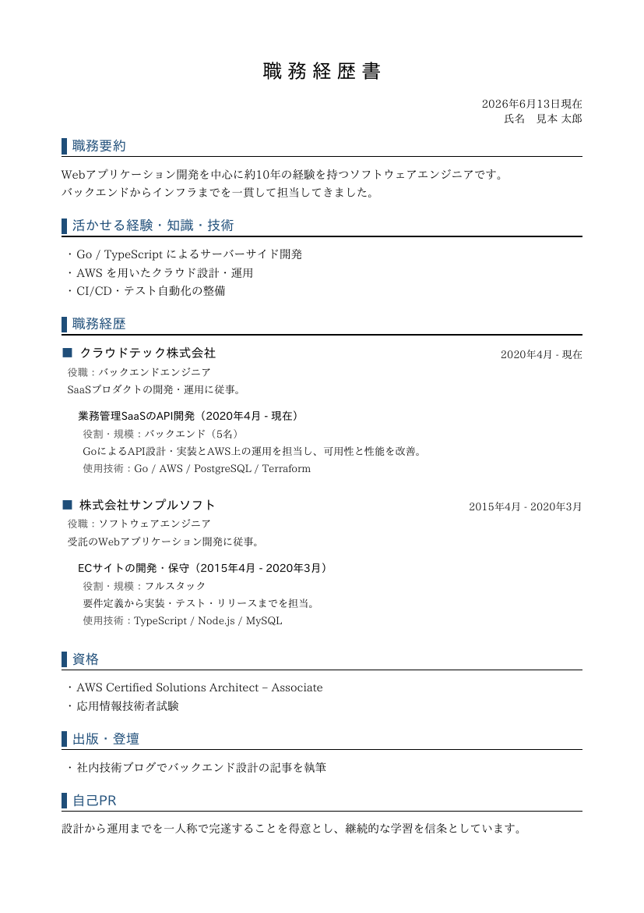

# career

[](https://github.com/nao1215/career/actions/workflows/build.yml)
[](https://github.com/nao1215/career/actions/workflows/unit_test.yml)
[](https://github.com/nao1215/career/actions/workflows/e2e_test.yml)
[](https://github.com/nao1215/career/actions/workflows/reviewdog.yml)


career is a command-line tool that renders résumé PDFs from one YAML file.

Hiring in Japan runs largely on two PDF documents — the 履歴書 (rirekisho) and the
職務経歴書 (work history) — while applying elsewhere usually means a CV. Maintaining
each as a separate word-processor file means editing the same facts in several
places and re-exporting by hand. career keeps the source as a single plain-text
file you can diff and version with Git, and produces each document from it on
demand.

- Output is PDF — the format these documents are actually submitted as.
- The Japanese 履歴書 and 職務経歴書 layouts are built in.
- Text fields can hold more than one language, so the same file backs a Japanese
  résumé and an English CV.
- One source file generates several document types.


## Example

```yaml
# resume.yaml
profile:
  name:
    ja: 見本 太郎
    en: Taro Mihon
  email: taro.mihon@example.com
career:
  summary:
    ja: バックエンドとクラウドを中心に約10年。
    en: About 10 years across backend and cloud.
  skills:
    - { ja: Go によるサーバーサイド開発, en: Backend development in Go }
```

```bash
career generate resume.yaml -t cv               -o cv.pdf
career generate resume.yaml -t japanese-resume  -o rirekisho.pdf
career generate resume.yaml -t work-history     -o shokumukeirekisho.pdf
```

## Install

```bash
go install github.com/nao1215/career@latest
```

Or build from source:

```bash
git clone https://github.com/nao1215/career.git
cd career
make build   # produces ./career
```

## Usage

Start a file, edit it, then render:

```bash
career init                              # write a starter resume.yaml
career generate resume.yaml -t cv -o cv.pdf
```

| Command | Description |
| :--- | :--- |
| `career init [PATH]` | Write a starter resume YAML file (`--force` to overwrite) |
| `career generate` | Render a resume YAML file into one or more PDFs |
| `career templates` | List the available templates |
| `career version` | Print the version |
| `career help [command]` | Show help |

`generate` takes the input file as the first argument or `--input`, the template
as `--template`/`-t`, the output as `--output`/`-o`, an accent color as
`--accent`, and a portrait as `--photo`.

With no `--template`, `generate` renders `cv`. Render several at once by repeating
`--template`, comma-separating names, or passing `all`; each goes to its default
file name (so `--output`, which names one file, is only valid with a single
template).

```bash
career generate resume.yaml                  # cv.pdf
career generate resume.yaml -t all           # cv.pdf, japanese-resume.pdf, work-history.pdf
career generate resume.yaml -t cv,work-history
```

## One file, multiple documents

Each template reads only the sections it needs, so all three documents live in
one file:

| Section | cv | japanese-resume | work-history |
| :--- | :---: | :---: | :---: |
| `profile` | ✓ | ✓ | ✓ |
| `education` | ✓ | ✓ | |
| `work` / `licenses` | | ✓ | |
| `rireki` (hobby, motivation, …) | | ✓ | |
| `career` (summary, skills, history, …) | ✓ | | ✓ |

### Multilingual fields

Any text field is either a plain scalar (used for every language) or a
`{ ja:, en: }` map. `cv` requests `en`, the Japanese templates request `ja`, and
either falls back to whatever is present, so a single-language file still works
everywhere.

```yaml
profile:
  name:
    ja: 見本 太郎
    en: Taro Mihon
career:
  summary:
    ja: 日本語の職務要約。
    en: English summary.
  skills:
    - { ja: Go によるサーバーサイド開発, en: Backend development in Go }
    - A scalar with no language map applies to both
```

`career generate -t cv` renders the English résumé while `-t work-history`
renders the Japanese 職務経歴書 from the same source.

## Templates

Templates are entries in a small registry, so a new layout, paper size, or
language is added by registering one more template.

### cv

An English résumé: a name and contact header, then Summary, Skills, Experience,
Education, Certifications, and Publications.


Sample: [`image/cv-sample.pdf`](./image/cv-sample.pdf)

### japanese-resume (履歴書)

The JIS-style 履歴書 on A4: photo frame, personal block, and the 学歴・職歴 and
免許・資格 tables. Long histories flow onto additional pages. This template always
renders in black, matching the convention for the form. Aliases: `履歴書`.

| Page 1 | Page 2 |
| :---: | :---: |
|  |  |

Sample: [`image/japanese-resume-sample.pdf`](./image/japanese-resume-sample.pdf)

### work-history (職務経歴書)

The Japanese 職務経歴書: 職務要約, skills, per-company project history, 資格, 出版,
and 自己PR, with automatic page breaks. Aliases: `職務経歴書`.



Sample: [`image/work-history-sample.pdf`](./image/work-history-sample.pdf)

All previews are rendered from [`examples/resume.yaml`](./examples/resume.yaml).

## Photo (履歴書)

Only `japanese-resume` has a photo frame (the JIS 3:4, 30×40mm box). Set it in
YAML or on the command line:

```yaml
profile:
  photo: face.jpg   # JPEG or PNG; resolved relative to this YAML file
```

```bash
career generate resume.yaml -t japanese-resume --photo face.jpg
```

`profile.photo` is resolved relative to the YAML file; `--photo` overrides it and
is resolved relative to the current directory. The image is fitted into the frame
without distortion. A non-3:4 image is centered with margins and a warning
suggests cropping; a missing file falls back to the placeholder. A sample
portrait of a fictional person is at
[`image/sample_japanese_man.jpg`](./image/sample_japanese_man.jpg), used in the
preview above.

## Accent color

`cv` and `work-history` use one accent color for headings. `japanese-resume`
ignores it and stays black.

```yaml
theme:
  accent: "#1f4e79"   # "" = default, "none" = monochrome, or any #rrggbb
```

```bash
career generate resume.yaml -t cv --accent none   # monochrome
```

## Design goals

- No dependency on a specific web service or office application; input and output
  are local files.
- Resume data stays plain text, so it is portable and reviewable in a diff.
- Career history is kept in version control like any other source.
- Japanese PDF-based hiring is a first-class use case, alongside bilingual use.
- One structured source produces several document formats, rather than
  maintaining each separately.

## Development

```bash
make tools     # install golangci-lint, octocov, shellspec
make test      # unit tests with coverage
make lint      # golangci-lint
make test-e2e  # shellspec end-to-end tests against the built binary
make build     # build ./career
make demo      # regenerate image/demo.gif (needs vhs)
```

## Fonts and license

career embeds the [IPAex fonts](https://moji.or.jp/ipafont/) (IPAex Mincho and
IPAex Gothic), distributed under the IPA Font License Agreement v1.0. The license
ships with the fonts under
[`internal/font/assets`](./internal/font/assets).

The career source code is released under the [MIT License](./LICENSE).
