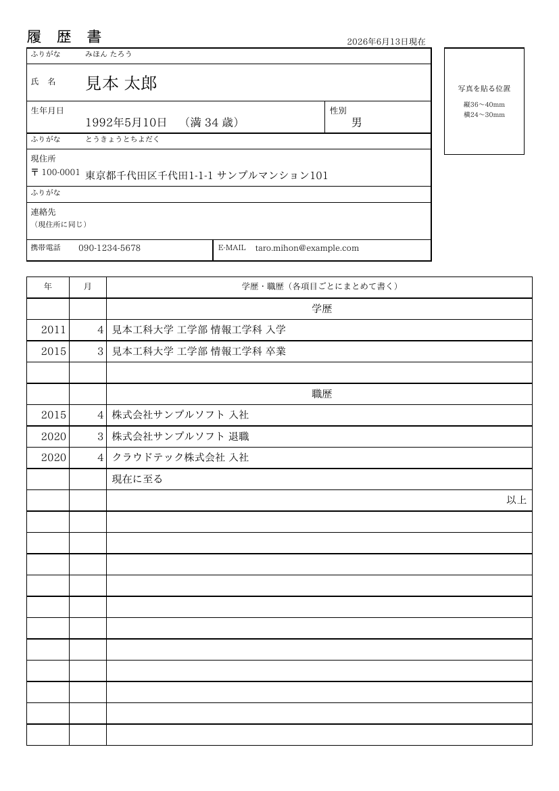
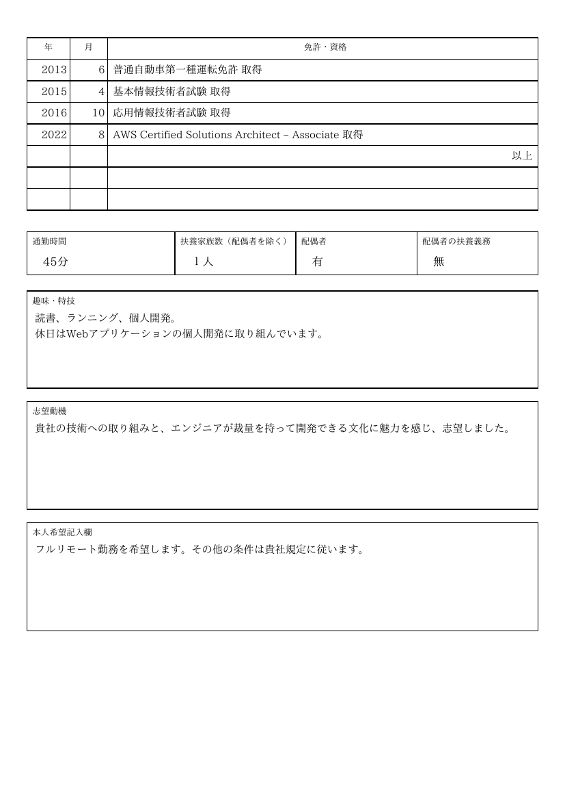
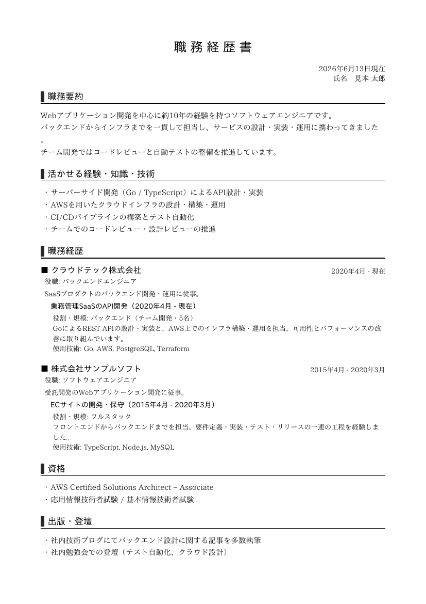

# career

[](https://github.com/nao1215/career/actions/workflows/build.yml)
[](https://github.com/nao1215/career/actions/workflows/unit_test.yml)
[](https://github.com/nao1215/career/actions/workflows/e2e_test.yml)
[](https://github.com/nao1215/career/actions/workflows/reviewdog.yml)

`career` is a command-line tool that turns a single YAML file into Japanese
résumé PDFs — a JIS-style **履歴書 (rirekisho)** and a **職務経歴書
(shokumukeirekisho / CV)**. Write your career once in plain text, keep it under
version control, and regenerate polished PDFs with one command.

YAMLファイル1つから、日本の **履歴書** と **職務経歴書** のPDFを生成するCLIツールです。
経歴をテキストで一元管理し、Gitでバージョン管理しながら、コマンド一発で清書できます。

### 履歴書 (rirekisho)

Sample PDF: [`image/rirekisho-sample.pdf`](./image/rirekisho-sample.pdf)

| Page 1 | Page 2 |
| :---: | :---: |
|  |  |

### 職務経歴書 (shokumukeirekisho)

Sample PDF: [`image/shokumukeirekisho-sample.pdf`](./image/shokumukeirekisho-sample.pdf)

| Page 1 | Page 2 |
| :---: | :---: |
|  |  |

These are rendered from [`examples/resume.yaml`](./examples/resume.yaml).

## Features

- **One YAML, two documents** — the same file feeds both the 履歴書 and the 職務経歴書.
- **JIS-style 履歴書** — the conventional two-page A4 layout with photo box, 学歴・職歴 and 免許・資格 tables.
- **Flowing 職務経歴書** — 職務要約 / skills / per-company project history / 資格 / 出版 / 自己PR with automatic page breaks.
- **Fonts bundled in** — IPAex Mincho/Gothic are embedded in the binary, so output is identical everywhere with no font setup.
- **Single static binary** — pure Go, `CGO_ENABLED=0`, no runtime dependencies.

## Install

```bash
go install github.com/nao1215/career@latest
```

Or build from source:

```bash
git clone https://github.com/nao1215/career.git
cd career
make build   # produces ./career
```

## Usage

```bash
# 履歴書 (rirekisho)
career generate resume.yaml --template rirekisho --output rirekisho.pdf

# 職務経歴書 (shokumukeirekisho / CV)
career generate resume.yaml --template shokumukeirekisho --output cv.pdf
```

The input file may be passed as the first argument or via `--input`, and short
flags are available (`-t`, `-i`, `-o`):

```bash
career generate -i resume.yaml -t rireki -o rirekisho.pdf
```

### Commands

| Command | Description |
| :--- | :--- |
| `career generate` | Render a resume YAML file into a PDF |
| `career templates` | List the available document templates |
| `career version` | Print the version |
| `career help [command]` | Show help |

### Templates

| Name | Aliases | Output |
| :--- | :--- | :--- |
| `rirekisho` | `rireki`, `resume` | JIS-style 履歴書 (A4, 2 pages) |
| `shokumukeirekisho` | `shokureki`, `career`, `cv` | 職務経歴書 |

## Writing your resume

Start from [`examples/minimal.yaml`](./examples/minimal.yaml) for a quick start,
or [`examples/resume.yaml`](./examples/resume.yaml) for a fully-commented
template that exercises every field.

```yaml
date: 2026年6月13日現在

profile:
  name: 山田 太郎
  name_kana: やまだ たろう
  birth_date: 1995年4月1日
  gender: 男
  email: taro@example.com
  phone: 090-0000-0000
  photo: ""            # optional: path to a JPEG/PNG portrait
  address:
    zip: 100-0001
    text: 東京都千代田区千代田1-1-1

education:             # 学歴 (oldest first)
  - { year: 2014, month: 4, value: 〇〇大学 入学 }
  - { year: 2018, month: 3, value: 〇〇大学 卒業 }

work:                  # 職歴
  - { year: 2018, month: 4, value: 〇〇株式会社 入社 }
  - { value: 現在に至る }

licenses:              # 免許・資格
  - { year: 2016, month: 8, value: 普通自動車第一種運転免許 取得 }

rireki:                # fields used only by the 履歴書
  hobby: 読書、ランニング
  motivation: 貴社の事業に貢献したいと考え、志望しました。

career:                # fields used only by the 職務経歴書
  summary: |
    〇〇株式会社でWebアプリケーションの開発に従事してきました。
  skills:
    - プログラミング（Go, TypeScript）
  histories:
    - company: 〇〇株式会社
      period: 2018年4月 - 現在
      role: ソフトウェアエンジニア
      projects:
        - title: 〇〇サービスの開発
          description: 〇〇を設計・実装しました。
          tech: [Go, AWS]
  self_pr: |
    〇〇を強みとし、〇〇に貢献できます。
```

`year` and `month` accept both numbers (`2018`) and strings (`"20XX"`), so you
can leave placeholders where a date is undecided. Multi-line fields use YAML
block scalars (`|`).

### Field reference

- `profile` — name, kana, birth date, gender, contact, and an optional photo path. Shared by both documents.
- `education` / `work` / `licenses` — dated rows (`year`, `month`, `value`) for the 履歴書 tables.
- `rireki` — `commuting_time`, `dependents`, `spouse`, `supporting_spouse`, `hobby`, `motivation`, `request`.
- `career` — `summary`, `skills`, `histories` (each with `company`, `period`, `role`, `summary`, `projects`), `certifications`, `publications`, `self_pr`.

## Development

```bash
make tools     # install golangci-lint, octocov, shellspec
make test      # unit tests with coverage
make lint      # golangci-lint
make test-e2e  # shellspec end-to-end tests against the built binary
make build     # build ./career
```

## Fonts and license

`career` embeds the [IPAex fonts](https://moji.or.jp/ipafont/) (IPAex Mincho and
IPAex Gothic), distributed under the IPA Font License Agreement v1.0. The license
text ships with the fonts under
[`internal/font/assets`](./internal/font/assets).

The `career` source code is released under the [MIT License](./LICENSE).

## Acknowledgements

The 履歴書 layout is inspired by
[kaityo256/yaml_cv](https://github.com/kaityo256/yaml_cv), a YAML-driven résumé
generator written in Ruby.
