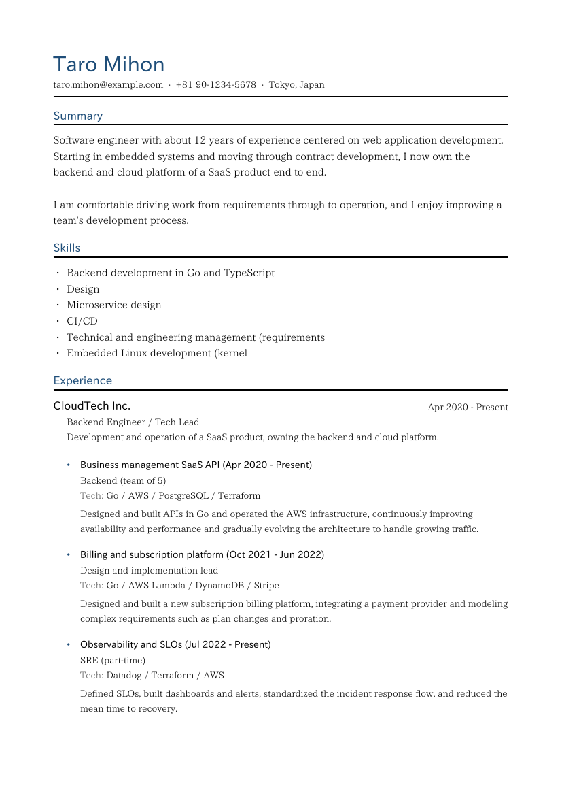
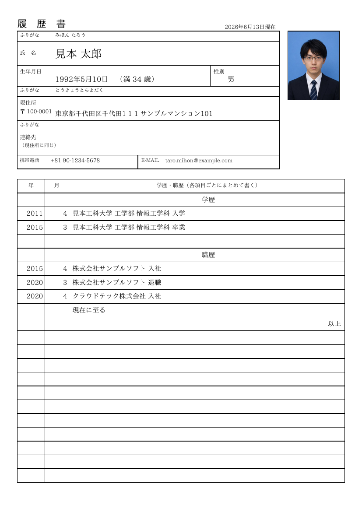
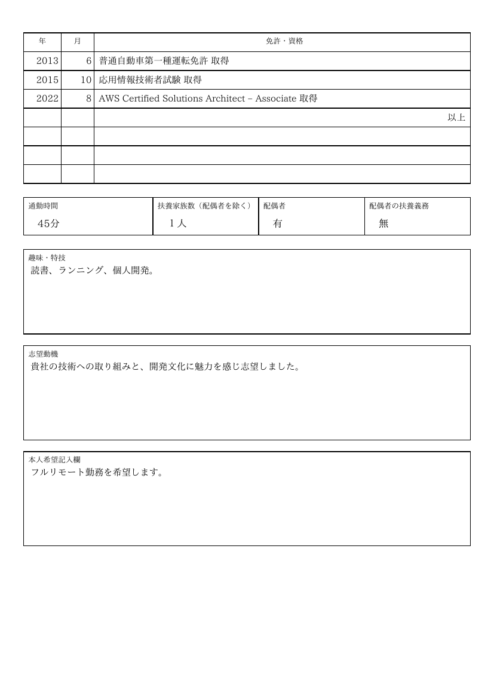
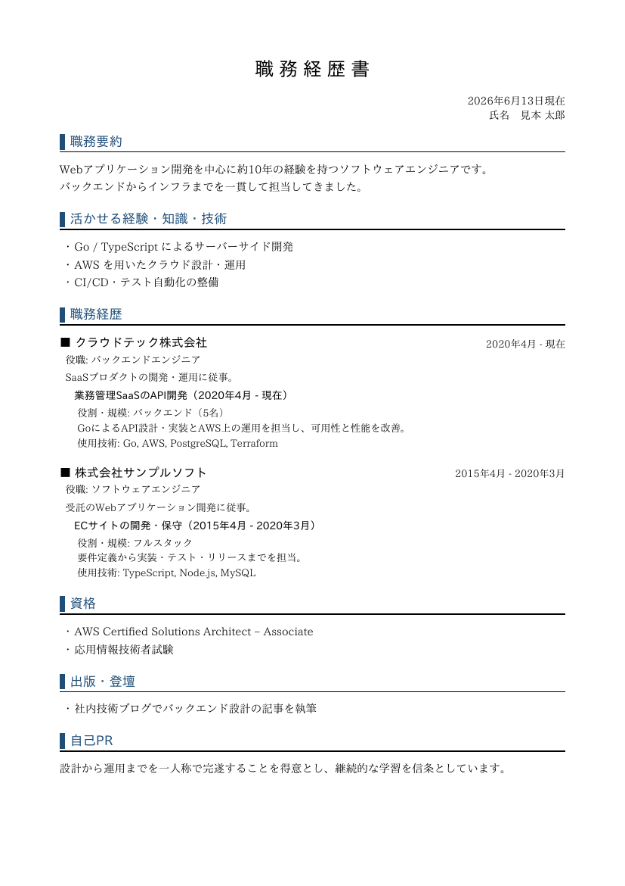

# career

[](https://github.com/nao1215/career/actions/workflows/build.yml)
[](https://github.com/nao1215/career/actions/workflows/unit_test.yml)
[](https://github.com/nao1215/career/actions/workflows/e2e_test.yml)
[](https://github.com/nao1215/career/actions/workflows/reviewdog.yml)

career generates résumé PDFs from a single YAML file. Write your career once in
plain text, keep it under version control, and render a polished PDF with one
command.

One file holds every document. Text fields can carry more than one language, so
the same file produces an English CV and the Japanese formats, each in the right
language:

- `cv` — an English curriculum vitae / résumé.
- `japanese-resume` — a JIS-style Japanese 履歴書.
- `career-history` — a Japanese 職務経歴書 (work history).

Templates live in a small registry, so adding another layout, paper size, or
language is a matter of registering one more template.


## Install

```bash
go install github.com/nao1215/career@latest
```

Or build from source:

```bash
git clone https://github.com/nao1215/career.git
cd career
make build   # produces ./career
```

## Quick start

```bash
career init                                            # write a starter resume.yaml
career generate resume.yaml -t cv -o cv.pdf            # then edit and render
```

## Commands

| Command | Description |
| :--- | :--- |
| `career init [PATH]` | Write a starter resume YAML file (`--force` to overwrite) |
| `career generate` | Render a resume YAML file into a PDF |
| `career templates` | List the available document templates |
| `career version` | Print the version |
| `career help [command]` | Show help |

`generate` takes the input file as the first argument or `--input`, the template
as `--template`/`-t`, the output as `--output`/`-o`, and an accent color as
`--accent`.

```bash
career generate resume.yaml -t cv               -o cv.pdf
career generate resume.yaml -t japanese-resume  -o rirekisho.pdf
career generate resume.yaml -t career-history   -o shokureki.pdf
```

Without `--template`, `generate` renders the `cv` template. Render several at
once by repeating `--template`, comma-separating names, or passing `all`; each
document is written to its default file name (so `--output`, which names a single
file, is only valid with one template).

```bash
career generate resume.yaml                       # cv.pdf (default)
career generate resume.yaml -t all                # cv.pdf, japanese-resume.pdf, career-history.pdf
career generate resume.yaml -t cv -t career-history
career generate resume.yaml -t cv,japanese-resume
```

## One file, multiple documents

Each template reads the sections it needs from the same YAML:

| Section | cv | japanese-resume | career-history |
| :--- | :---: | :---: | :---: |
| `profile` | ✓ | ✓ | ✓ |
| `education` | ✓ | ✓ | |
| `work` / `licenses` | | ✓ | |
| `rireki` (hobby, motivation, …) | | ✓ | |
| `career` (summary, skills, history, …) | ✓ | | ✓ |

Sections a template does not use are simply ignored, so the three documents
coexist in one file.

### Multilingual fields

Any text field is either a plain scalar (used for every language) or a
`{ ja:, en: }` map. The `cv` template asks for `en`, the Japanese templates ask
for `ja`, and either falls back to whatever is present.

```yaml
profile:
  name:
    ja: 見本 太郎
    en: Taro Mihon
career:
  summary:
    ja: Webアプリケーション開発を中心に約10年の経験があります。
    en: About 10 years of experience in web application development.
  skills:
    - { ja: Go によるサーバーサイド開発, en: Backend development in Go }
    - English and Japanese are both optional; a scalar applies everywhere
```

So one `career generate ... -t cv` renders the English résumé while
`-t career-history` renders the Japanese 職務経歴書 from the same source.

## Templates

### cv

An English résumé: name and contact header, then Summary, Skills, Experience,
Education, Certifications, and Publications.



Download: [`image/cv-sample.pdf`](./image/cv-sample.pdf)

### japanese-resume (履歴書)

The conventional two-page A4 履歴書: photo box, personal block, and the
学歴・職歴 and 免許・資格 tables. This template always renders in black, as a
formal Japanese form should.

| Page 1 | Page 2 |
| :---: | :---: |
|  |  |

Download: [`image/japanese-resume-sample.pdf`](./image/japanese-resume-sample.pdf)

### career-history (職務経歴書)

A flowing 職務経歴書: 職務要約, skills, per-company project history, 資格,
出版, and 自己PR, with automatic page breaks.



Download: [`image/career-history-sample.pdf`](./image/career-history-sample.pdf)

All previews are rendered from [`examples/resume.yaml`](./examples/resume.yaml).

## Accent color

The `cv` and `career-history` templates use a single accent color for headings.
Set it in YAML or override it on the command line; `japanese-resume` ignores it
and stays black.

```yaml
theme:
  accent: "#1f4e79"   # "" = default slate blue, "none" = monochrome, or any #rrggbb
```

```bash
career generate resume.yaml -t cv --accent "#2c6e6e"   # custom
career generate resume.yaml -t cv --accent none        # monochrome
```

## Photo (履歴書)

Only the `japanese-resume` template has a photo frame (the JIS 3:4, 30×40mm box).
Set it in YAML or on the command line:

```yaml
profile:
  photo: face.jpg   # JPEG or PNG; resolved relative to this YAML file
```

```bash
career generate resume.yaml -t japanese-resume --photo face.jpg
```

A `profile.photo` path is resolved relative to the YAML file, while `--photo`
(which overrides it) is resolved relative to the current directory. The photo is
fitted into the frame without distortion; if its aspect ratio is not 3:4 it is
centered with margins and a warning suggests cropping. A missing or unreadable
file falls back to the placeholder box with a warning.

A 3:4 sample portrait of a fictional person lives at
[`image/sample_japanese_man.jpg`](./image/sample_japanese_man.jpg), and the
履歴書 preview above is rendered with it:

```bash
career generate examples/resume.yaml -t japanese-resume --photo image/sample_japanese_man.jpg
```

## Writing your resume

`career init` writes a starter file with the common fields filled in. For a
fully populated bilingual sample, see
[`examples/resume.yaml`](./examples/resume.yaml).

`year` and `month` accept both numbers (`2018`) and strings (`"20XX"`).
Multi-line fields use YAML block scalars (`|`).

## Development

```bash
make tools     # install golangci-lint, octocov, shellspec
make test      # unit tests with coverage
make lint      # golangci-lint
make test-e2e  # shellspec end-to-end tests against the built binary
make build     # build ./career
make demo      # regenerate image/demo.gif (needs vhs)
```

## Fonts and license

career embeds the [IPAex fonts](https://moji.or.jp/ipafont/) (IPAex Mincho and
IPAex Gothic), distributed under the IPA Font License Agreement v1.0. The license
text ships with the fonts under
[`internal/font/assets`](./internal/font/assets).

The career source code is released under the [MIT License](./LICENSE).

## Acknowledgements

The 履歴書 layout is inspired by
[kaityo256/yaml_cv](https://github.com/kaityo256/yaml_cv), a YAML-driven résumé
generator written in Ruby.
